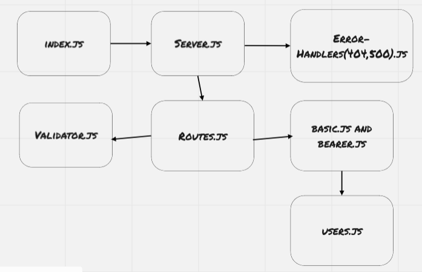

# Bearer Auth

### URLs

[Heroku](https://bashar-bearer-auth.herokuapp.com/)\
[GitHub Actions](https://github.com/BasharNofal/bearer-auth/actions)\
[Pull Request](https://github.com/BasharNofal/bearer-auth/pull/1)

### UML Diagram

### How do I install the app or library?

  1. Clone the repo from git hub, by run the following command `git clone -repo link-`.
  2. Run `npm init -y`.
  3. Run `npm i "dependencies names which you can find in the package.json file"`.
  4. Create .env file and PORT inside it.
- How do I test the app or library?
  - Just run `npm test`
For Applications:
  - How do I run the app?
    - Run `npm start` or `node index.js`.
  - How do I set up the app?
    1. Clone the repo from git hub, by run the following command `git clone -repo-`.
    2. Run `npm init -y`.
    3. Run `npm i "dependencies names which you can find in the package.json file"`.
    4. Create .env file,SECRET and PORT inside it.
    5. Then run `npm start`.